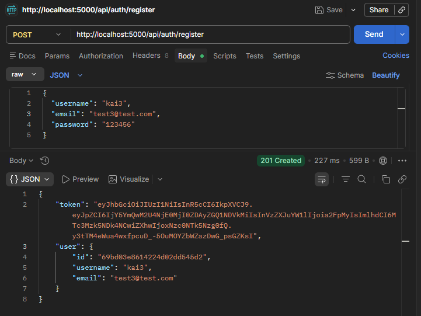

# ChatApp — Server

REST API and real-time WebSocket backend for ChatApp. Built with Node.js, Express, Socket.io, and MongoDB. Handles user authentication with JWT and real-time room-based messaging.

---

## Screenshots

### API — Register Endpoint (Postman)


---

## Features

- 🔐 User registration and login with bcrypt password hashing
- 🎟️ JWT-based authentication for both REST and WebSocket connections
- 💬 Real-time room-based messaging via Socket.io
- 👥 Live online user tracking per room
- 💾 Message persistence in MongoDB
- 📜 Message history API (last 50 messages per room)
- 🔔 Join and leave event broadcasting
- 🛡️ Protected routes via auth middleware

---

## Tech Stack

| Layer | Technology |
|-------|-----------|
| Runtime | Node.js |
| Framework | Express.js |
| Real-time | Socket.io |
| Database | MongoDB + Mongoose |
| Auth | JWT + bcryptjs |
| Config | dotenv |

---

## Getting Started

### Prerequisites

- Node.js v18+
- MongoDB running locally (default: `mongodb://localhost:27017`) or a MongoDB Atlas URI

### Installation


1) Clone the repository
```
git clone https://github.com/singhkailash9/chat-app-server.git
cd chat-app-server
```

2) Install dependencies
```
npm install
```

3) Create environment file and fill in your values (see Environment Variables below)

4) Start development server
```
npm run dev
```

Server runs on [http://localhost:5000](http://localhost:5000)

---

## Environment Variables

Create a `.env` file in the root:

```
PORT=5000
MONGO_URI=your_mongo_connection_string
JWT_SECRET=your_secret_key_here
```

> ⚠️ Never commit your `.env` file. It's already in `.gitignore`.

---

## API Reference

### Auth Routes — `/api/auth`

#### Register
```
POST /api/auth/register

Body:
{
  "username": "test",
  "email": "test@example.com",
  "password": "123456"
}

Response 201:
{
  "token": "eyJhbGci...",
  "user": { "id": "...", "username": "test", "email": "test@example.com" }
}
```

#### Login
```
POST /api/auth/login

Body:
{
  "email": "test@example.com",
  "password": "123456"
}

Response 200:
{
  "token": "eyJhbGci...",
  "user": { "id": "...", "username": "test", "email": "test@example.com" }
}
```

### Message Routes — `/api/messages`

#### Get Room History
```
GET /api/messages/:room

Headers:
Authorization: Bearer <token>

Response 200: Array of last 50 messages sorted oldest → newest
```

---

## Socket.io Events

### Client → Server

| Event | Payload | Description |
|-------|---------|-------------|
| `joinRoom` | `{ room }` | Join a chat room |
| `sendMessage` | `{ text, room }` | Send a message to a room |

### Server → Client

| Event | Payload | Description |
|-------|---------|-------------|
| `receiveMessage` | `{ _id, senderName, text, room, createdAt }` | New message broadcast |
| `userJoined` | `{ message }` | User joined notification |
| `userLeft` | `{ message }` | User left notification |
| `onlineUsers` | `string[]` | Updated list of online usernames in room |

### Authentication

Socket connections are authenticated via JWT passed in the handshake:

```js
const socket = io("http://localhost:5000", {
  auth: { token: "your_jwt_token" }
});
```

Connections without a valid token are rejected before the `connection` event fires.

---

## Project Structure

```
server/
├── config/
│   └── db.js            # MongoDB connection
├── middleware/
│   └── auth.js          # JWT verification middleware
├── models/
│   ├── User.js          # User schema (username, email, password)
│   └── Message.js       # Message schema (sender, senderName, room, text)
├── routes/
│   ├── auth.js          # Register + Login routes
│   └── messages.js      # Message history route
└── index.js             # Express app + Socket.io setup
```

---

## Related

- **Frontend repo:** [chat-app-client](https://github.com/singhkailash9/chat-app-client)

---

## Author

**Kailash Singh** — [GitHub](https://github.com/singhkailash9) · [LinkedIn](https://www.linkedin.com/in/kailash-singh-725a10232/)